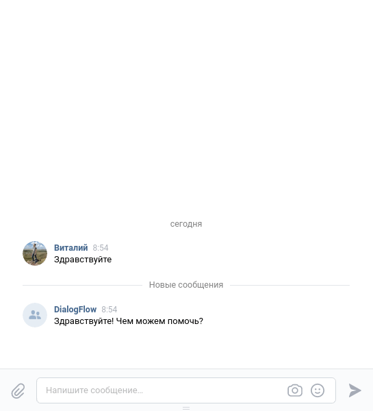

# Бот службы поддержки

Репозиторий содержит боты для Telegram и группы ВК, который обрабатывает вопросы пользователей и с
помощью [DialogFlow](https://dialogflow.cloud.google.com) (платформа для понимания естественного языка, которая
предоставляет наиболее подходящие ответы на вопросы) предоставляет им ответы.

Пример для Telegram:


Пример для VK:



[Демо-бот в Telegram](https://t.me/poymanov_dvmn_support_bot)

[Демо-группа с ботом в VK](https://vk.com/club208751925)

### Установка

Для работы приложения требуется **Docker** и **Docker Compose**.

Для инициализации приложения выполнить команду:

```
make init
```

### Настройка

В файле `.env` заполнить:

|Параметр|Описание |
|-----------|-----------|
|*TELEGRAM_LOGGER_BOT_TOKEN*|Токен бота в Telegram для логирования ошибок|
|*TELEGRAM_LOGGER_USER_CHAT_ID*|ID пользователя, которому будут приходить ошибки ботов в Telegram|
|*TELEGRAM_BOT_TOKEN*|Токен бота поддержки в Telegram|
|*VK_GROUP_TOKEN*|Токен бота поддержки в VK|
|*DIALOG_FLOW_PROJECT_ID*|ID проекта с вариантами вопросов/ответов в [DialogFlow](https://dialogflow.cloud.google.com):|

Выполнить первичное обучение ботов через [DialogFlow](https://dialogflow.cloud.google.com):

```
make learn
```

### Запуск

Telegram бот:

```
make tg-bot 
```

Бот группы VK:

```
make vk-bot
```

Удаление всех временных файлов приложения:

```
make flush
```

### Цель проекта

Код написан в образовательных целях на онлайн-курсе [dvmn.org](https://dvmn.org/), в рамках
модуля [Чат-боты на Python](https://dvmn.org/modules/chat-bots).